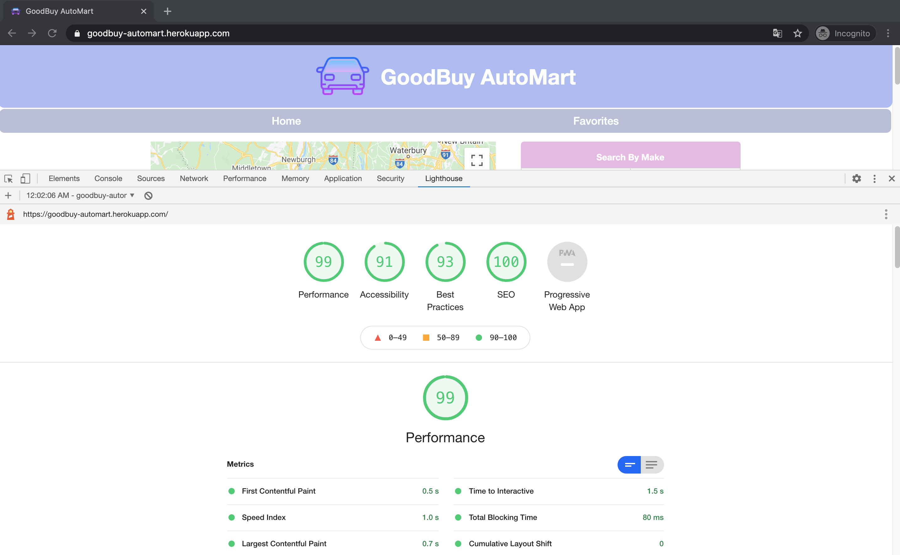

# GoodBuy AutoMart

GoodBuy AutoMart is a user-friendly single-page application designed for searching used car locations on Google Maps. It utilizes the Google Maps Platform and its various APIs. The primary technologies used include React hooks for rendering custom styled-components, Express for retrieving data from a custom-built API, CSS for styling, and MySQL for storing used car listings extracted from Craigslist.

## Building and Running Environment

First install dependencies:

```sh
npm install
```

To create a development build:

```sh
npm run build-dev
```

To run node server:

```sh
npm start-dev
```

## Tech Stack
* [React](https://reactjs.org)
* [Node](https://nodejs.org/en)
* [Express](http://expressjs.com)
* [MySQL](https://www.mysql.com)
* [Heroku](https://www.heroku.com)

## Search and Favorites Page

The Home page consists of the navigation component at the top, the map component on the left, and the search component on the right. The navigation section offers options to choose between the Home and Favorites pages. The map section displays markers indicating the locations of available used cars. The search section enables users to search and sort cars based on various options. The details component, located below the search section, provides detailed information about the selected car and includes a button to add it to the Favorites page. Users can view and remove cars saved on the Favorites page.


## Running

Open [GoodBuy AutoMart](https://goodbuy-automart.herokuapp.com) in the browser.

## Lighthouse Score



## Future Implementations

* Landing Page
* Authentication
